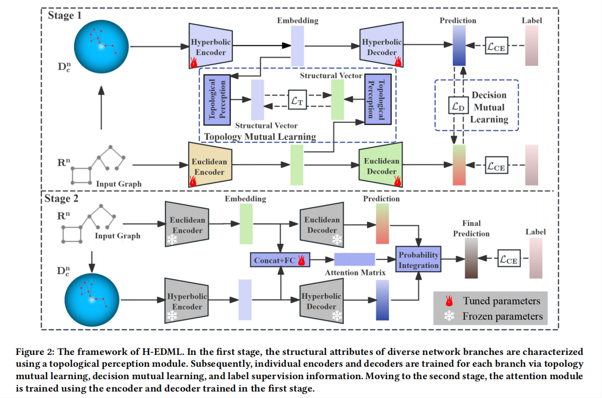

# Hyperbolic-Euclidean Deep Mutual Learning (H-EDML)

**Official PyTorch implementation of our H-EDML accepted by The Web Conference (WWW) 2025**  

==================================================

## 1. Overview

This repository contains the experimental implementation of Hyperbolic-Euclidean Deep Mutual Learning (H-EDML) for node classification(nc).<br>

The method jointly trains a hyperbolic branch and a Euclidean branch, and enables them to improve each other through two mutual learning mechanisms:<br>

Topology Mutual Learning (TML): aligns representations from the two geometries at the structural level;<br>
Decision Mutual Learning (DML): transfers predictive knowledge through soft-label distillation;<br>
Attention-based Probabilistic Integration: in the second stage, an attention module is trained to fuse the predictions of the two branches.<br>

The overall optimization follows a two-stage training strategy:<br>

Stage 1: jointly train the hyperbolic branch and the Euclidean branch;<br>
Stage 2: freeze the two pretrained base branches and train only the attention module for probability fusion.<br>


<p align="center">
  
</p>


## 2. Setup
### 2.1 Requirements
python == 3.8.20<br>
torch == 1.8.0<br>
numpy == 1.22.4<br>
scipy == 1.6.3<br>
networkx == 2.5<br>
sage == 9.0<br>
pandas == 2.0.3<br>
geoopt ==0.1.0<br>
torch_scatter == 2.0.6<br>
torch_sparse == 0.6.9<br>
torch_geometric == 2.0.0<br>


### 2.2 Folders
  The ```data/``` folder contains five datasets: cora/citeseer/pubmed/disease/airport.<br>
  The ```layers/``` folder contains basic operations of euclidean ```layers``` and hyperbolic ```hyp_layers```.<br>
  The ```manifolds/``` folder contains basic operations of euclidean space and hyperbolic space.<br>
  The ```models/``` folder contains the base models, encoders and decoders.<br>
  The ```utils/``` folder contains the basic utils for data/eval/train, besides, ```hyperbolicity``` is used for calculating the distribution of hyperbolicity.<br>


## 3. Usage

We provide the training commands for reproducing the node classification experiments of H-EDML. 

#### Node classification for H-EDML

  * Cora:

```python train.py --task nc --dataset cora --alpha-D 0.5 --alpha-T 0.1 --dropout 0.3 --weight-decay 0.001 --manifold PoincareBall --lr 0.01 --dim 16 --num-layers 3 --reduction-D sum --reduction-T sum --act elu```

  * Citeseer:

```python train.py --task nc --dataset citeseer --alpha-D 1.0 --alpha-T 0.01 --dropout 0.2 --weight-decay 0.001 --manifold PoincareBall --lr 0.01 --dim 16 --num-layers 3 --reduction-D sum --reduction-T sum --act elu```

  * Pubmed:

```python train.py --task nc --dataset pubmed --alpha-D 0.1 --alpha-T 0.001 --dropout 0.6 --weight-decay 0.001 --manifold PoincareBall --lr 0.01 --dim 16 --num-layers 3 --reduction-D sum --reduction-T sum --act elu```

  * Airport:

```python train.py --task nc --dataset airport --alpha-D 0.001 --alpha-T 0.001 --dropout 0.0 --weight-decay 0.000 --manifold PoincareBall --normalize-feats 0 --lr 0.01 --dim 16 --num-layers 3 --epochs 4000 --reduction-D batchmean --reduction-T sum --act relu```

  * Disease:

```python train.py --task nc --dataset disease_nc --alpha-D 0.5 --alpha-T 0.1 --dropout 0.0 --weight-decay 0.0005 --manifold PoincareBall --lr 0.01 --dim 16 --num-layers 3 --patience 500 --epochs 4000 --reduction-D batchmean --reduction-T batchmean --act relu```


## Citation

If you find this code useful, please cite the following paper: 
```
@inproceedings{cao2025hyperbolic,
  title={Hyperbolic-Euclidean Deep Mutual Learning},
  author={Cao, Haifang and Wang, Yu and Li, Jialu and Zhu, Pengfei and Hu, Qinghua},
  booktitle={Proceedings of the ACM on Web Conference 2025},
  pages={3073--3083},
  year={2025}
}
```

